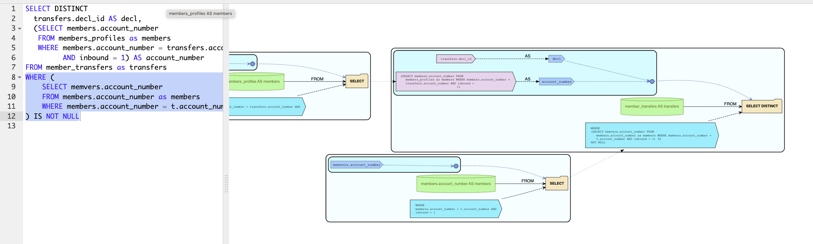

# Nuna: sql_tools

This repository contains Python libraries for helping developers
produce and maintain data analysis projects. In particular:

* `dataschema`: a library for defining data schemas using Python
dataclasses, that that can be easily converted between protobuffers,
Scala case classes, sql (ClickHouse) create table statements,
Parquet Arrow schemas and so on, from a central Python based
representation. Includes facilities to generate sample date and
compare schemas for validations.

* `sql_analyze`: a library for analyzing SQL statements. In particular
the raw SQL statments are parsed and converted to a Python based
data structure. From here, they can be converted to a data graph,
visualized, and information about the lineage of tables and columns
can be infered. Support for now SparkSql and ClickHouse dialects
for parsing.


## Requirements:

The project needs [Bazel](https://bazel.build/) for building, and
requires Python 3.7 or higher, dependent on the `requirements.txt`
packages (e.g. `numpy` may not work w/ 3.10). The preferred way is to use
[bazelisk](https://github.com/bazelbuild/bazelisk) launcher
for Bazel.

## Quick Demo:

To quickly check out the SQL visualizer included in this project,
run `./run_viewer.sh` from the top directory (Bazel required),
navigate to [http://localhost:8000/] and examine some SQL statements.
Here is an exmple analysis:




## `dataschema` Module

The general idea is to have a medium independent representation for
a schema, and code to convert to/from different types of schemas.
The main schema representation if defined in
[`Schema.py`](dataschema/Schema.py), which includes the `Column`
and `Table` classes, to represent a column and table in the schema.
The data enclosed in these classes is also presented in the protocol
buffers from [`Schema.proto`](dataschema/Schema.proto), which
are in fact used as substructures for the python classes.

Some usage examples, which are detailed in this README, can be found in
[examples/dataschema_example.py](examples/dataschema_example.py)

### `Schema.Table` from Python [`dataclass`](https://docs.python.org/3/library/dataclasses.html).

In Python, a table schema can be defined as a `dataclass`, with
possible annotations allowed. For example lets create a dataclass
schema for a fictional customer information structure:


```python
@dataclasses.dataclass
class CustomerInfo:
    # Annotated as ID column:
    customer_id: schema_types.Id(str)
    order_count: int
    start_date: datetime.date
    end_date: typing.Optional[datetime.date]
    # A List[decimal.Decimal] with annotated precision and scale:
    last_payments: schema_types.DecimalList(10, 2)
```

This dataclass can be converted to a `Schema.Table` structure using:

```python
from dataschema import python2schema
table = python2schema.ConvertDataclass(CustomerInfo)
```

This central data format can be converted to a variety of schema representations,
using the various `schema2FORMAT` sub-modules in the `dataschema` module.

### [ChickHouse](https://clickhouse.com/) `CREATE TABLE` SQL statements:

This can be used to generate SQL code to be sent directly to ClickHouse
for creating a table for storing customer info:

```python
from dataschema import schema2sql
schema2sql.ConvertTable(table, table_name='customers')
```

Generated statment for our schema is:

```sql
CREATE TABLE customers (
  customer_id String,
  order_count Int64,
  start_date Date,
  end_date Nullable(Date),
  last_payments Array(Decimal64(2))
)
```

### Scala Case Class

This can be used as a build step for generating `.scala` files for an
[Apache Spark](https://spark.apache.org/) project:

```python
from dataschema import schema2scala
schema2scala.ConvertTable(table, java_package='com.mycompany.example'
```

Generated code for our example is:

```scala
package com.mycompany.example
import java.sql.Date
import javax.persistence.Id
import org.apache.spark.sql.types.Decimal

case class CustomerInfo(
  @Id
  customer_id: String,
  order_count: Long,
  start_date: Date,
  end_date: Option[Date],
  last_payments: Seq[Decimal]
)
```

### [Apache Arrow](https://arrow.apache.org/) Schema

Using this mechanism allows for easily creating Parquet files:

```python
from dataschema import schema2parquet
schema2parquet.ConvertTable(table)
```

In our example the generated Arrow schema is:

```
customer_id: string not null
order_count: int64 not null
start_date: date32[day] not null
end_date: date32[day]
last_payments: list<element: decimal128(10, 2) not null>
  child 0, element: decimal128(10, 2) not null
```

### SQL Alchemy Table

To instantiate a SQL Alchemy
[Table Configuration](https://docs.sqlalchemy.org/en/13/orm/extensions/declarative/table_config.html):


```python
from dataschema import schema2sqlalchemy
schema2sqlalchemy.ConvertTable(table)
```

Which generates a configuration for the following table:

```sql
CREATE TABLE "CustomerInfo" (
	customer_id VARCHAR NOT NULL,
	order_count INTEGER NOT NULL,
	start_date DATE NOT NULL,
	end_date DATE,
	last_payments ARRAY,
	PRIMARY KEY (customer_id)
)
```

### DBML Table Specification

To convert a `Schema.Table` to a [DBML](https://www.dbml.org/) table
specification use:

```python
from dataschema import schema2dbml
schema2dbml.ConvertTable(table)
```

For our example, the generated specification is:

```dbml
Table CustomerInfo {
    customer_id String [not null, primary key]
    order_count Int64 [not null]
    start_date Date [not null]
    end_date Date
    last_payments Array(Decimal(10, 2))
}
```

### Pandas Data Types

Convert to a dictionary of column names and
[Pandas](https://pandas.pydata.org/) data types with:

```python
from dataschema import schema2pandas
schema2pandas.ConvertTable(table)
```

The converted result for our example is:

```python
{
  'customer_id': string[python],
  'order_count': Int64Dtype(),
  'start_date': 'O',
  'end_date': 'O',
  'last_payments': 'O'
}
```

### Python Code Snippet

Lastly, a `Schema.Table` can be converted back to a Python code snippet.
This may be useful when obtaining the schema through other means, that we
will discuss later.

```python
from dataschema import schema2python
schema2python.ConvertTable(table)
```

For our example schema table we will generate back:

```python
import dataclasses
import datetime
import decimal
import typing
from dataschema import annotations
from dataschema.entity import Annotate

JAVA_PACKAGE = "CustomerInfo"

@dataclasses.dataclass
class CustomerInfo:
    customer_id: Annotate(str, [annotations.Id()])
    order_count: int
    start_date: datetime.date
    end_date: typing.Optional[datetime.date]
```

### Other Sources of `Schema.Table`

Another way of defining a schema table is through a
[protocol buffer](https://developers.google.com/protocol-buffers)
message. Please consult
[`examples/example.proto`](examples/example.proto)
on how to do it for our `CustomerInfo` structure. To process that use:

```python
from examples import example_pb2  # import the proto python module
from dataschema import proto2schema
table = proto2schema.ConvertMessage(example_pb2.CustomerInfo.DESCRIPTOR)
```

After this, with `table` you can perform any of the operations described above.

You can obtain it also from a Parquet file, ie. a
[`parquet.ParquetFile`](https://arrow.apache.org/docs/python/generated/pyarrow.parquet.ParquetFile.html)
object:

```python
from dataschema import parquet2schema

# Can use this utility we provide to open a parquet file:
parquet_file = parquet2schema.OpenParquetFile(file_name)
table = parquet2schema.ConvertParquetSchema(parquet_file)
```

Using the `sql_analyze` package, you can obtain the `Schema.Table` for
a ClickHouse `CREATE TABLE` statement:

```python
from sql_analyze.grammars.ClickHouse import parse_sql_lib
statement = parse_sql_ch.parse_clickhouse_sql_create("""
CREATE TABLE CustomerInfo (
  customer_id String,
  order_count Int64,
  start_date Date,
  end_date Nullable(Date),
  last_payments Array(Decimal64(2))
)
""")
table = statement.schema
```

### `Schema.Table` Comparisons

We support comparissons of `Schema.Table` objects using
`diffs = dest_table.compare(src_table)`. This checks if data with
a schema described by `src_table` can be read into `dest_table`.
Note that we report any differences, but some of them can allow
for safe conversions, like columns present in destination but not in source,
or nullables in destination but not in source etc.

You can inspect the possible differences by checking `Schema.SchemaDiff` class.

### Synthetic Data Generation

A synthetic data generator module is included in this library in the
[`synthgen`](dataschema/synthgen.py) sub-module. Please consult the
the `BuildGenerator()` function docstring for a detailed description of
data generators.

This can be employed automatically to generate synthetic data for test
for any set `Schema.Table` schemas, using the utilities from
[`schema_synth`](dataschema/schema_synth.py) submodule.
We support some default generators based on the schema column types,
and support proper generation of values to support joining between tables
generated under the same session. Also, dataclass schemas can be annotated
with synthetic data generation specifications, and furthermore, upon
instantiation of the table generators, these can be overridden.

Here is an example of generating some out of the box synthetic data for our
example schema table, and writing it to some output files:

```python
from dataschema import schema_synth
# Builde of the synthetic data generator(s):
builder = schema_synth.Builder()
# Build the generators for a set of tables (in our case only one).
# When building for schemas with inter-table join dependencies, pass them
# all in the tables list:
generators = builder.schema_generator(
    output_type=schema_synth.OutputType.DATAFRAME,
    tables=[table])

# Build the output file(s) specification for 20 records per file.
# More options exist for this:
file_info = [
    schema_synth.FileGeneratorInfo(gen, num_records)
    for gen in generators
]

# Generate data and write it to some files:

from dataschema import data_writer
# Generate some data in CSV format in the provided `output_dir`
csv_file_names = schema_synth.GenerateFiles(
    file_info, data_writer.CsvWriter(), output_dir)

# Generate some data in a Parquet file:
parquet_file_names = schema_synth.GenerateFiles(
    file_info, data_writer.ParquetWriter(), output_dir)

# Other formats are supported as well !
```
